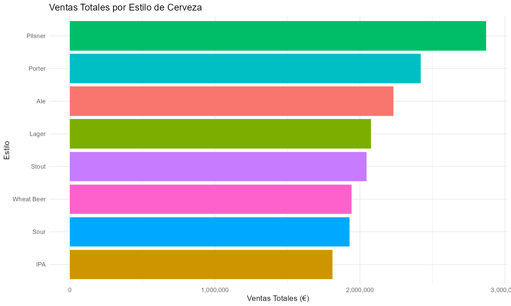
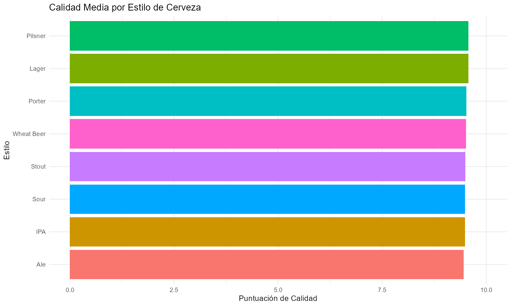
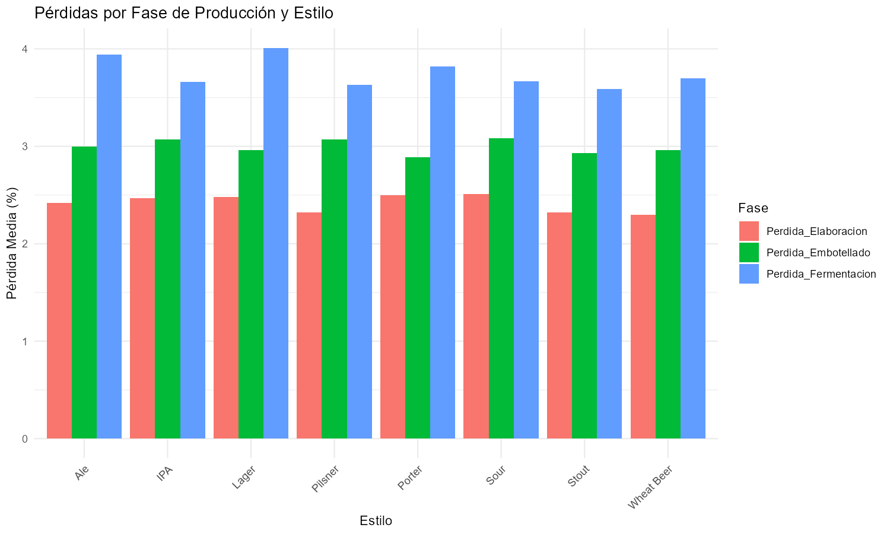
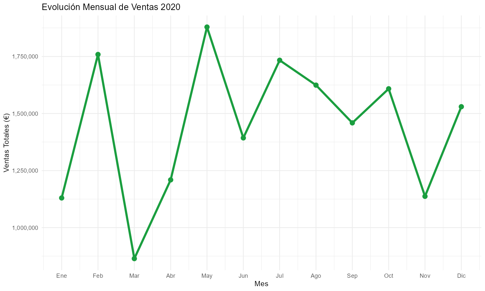
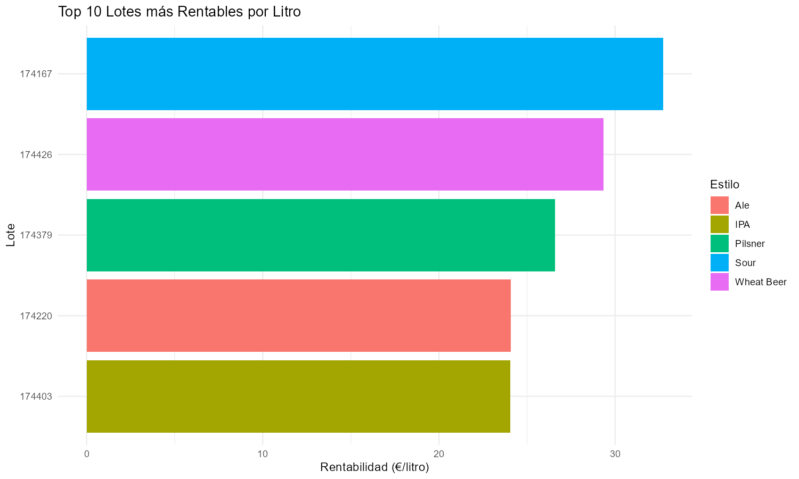

🇬🇧 English version | 🇪🇸 [Versión en español](README.md)

# 🍺 Brewery Market Analysis — SQL + R

## Overview
Comprehensive analysis of production and commercial 
performance of a brewery using SQL for data extraction 
and aggregation and R for statistical visualization. 
Built as part of my data analytics portfolio targeting 
the beverages and FMCG sector.

## Objective
Identify production, quality, efficiency and 
profitability patterns by beer style and location, 
extracting actionable insights for business 
decision-making.

## Dataset
- **Source:** Kaggle — Brewery Operations and Market 
  Analysis Dataset
- **Size:** 583 records × 20 columns
- **Period:** January — December 2020
- **SQL Engine:** SQLite (DBeaver)

## Tools & Technologies
- **SQL / SQLite** — data extraction and aggregation
- **DBeaver** — database manager
- **R / RStudio** — statistical analysis and visualization
- **ggplot2** — high quality charts
- **tidyverse** — data manipulation

## SQL Queries
- Total sales by beer style
- Production efficiency by location
- Average quality by style (pH, alcohol, bitterness)
- Loss analysis by production phase
- Monthly sales evolution
- Top 10 most profitable batches per liter

## Key Insights
- 🍺 Pilsner leads in total sales
- ⭐ Pilsner and Lager tie in quality (9.57/10)
- ⚠️ Lager shows highest production losses
- 📈 May is the highest revenue month
- 💰 Sour dominates Top 10 profitability per liter
- 🏭 Marathahalli is the most efficient location

## Visualizations

## Author
**Daniel Díaz De La Fuente**
Aspiring Data Analyst | SQL · R · Power BI · Python
Google Data Analytics Certificate (94.85% avg) ·
Business Analytics with Excel — Johns Hopkins
📍 Seville, Spain
[LinkedIn](https://www.linkedin.com/in/danieldiazdelafuente/) | [GitHub](https://github.com/DeLabFuente)

> 📥 SQL script and R code available in this repository